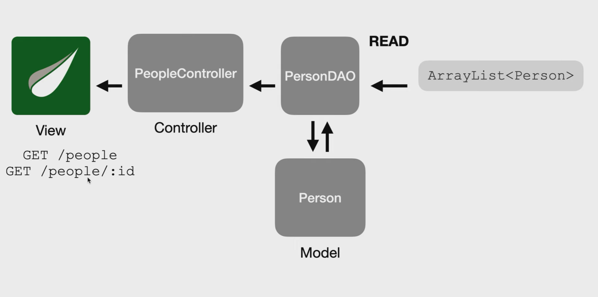
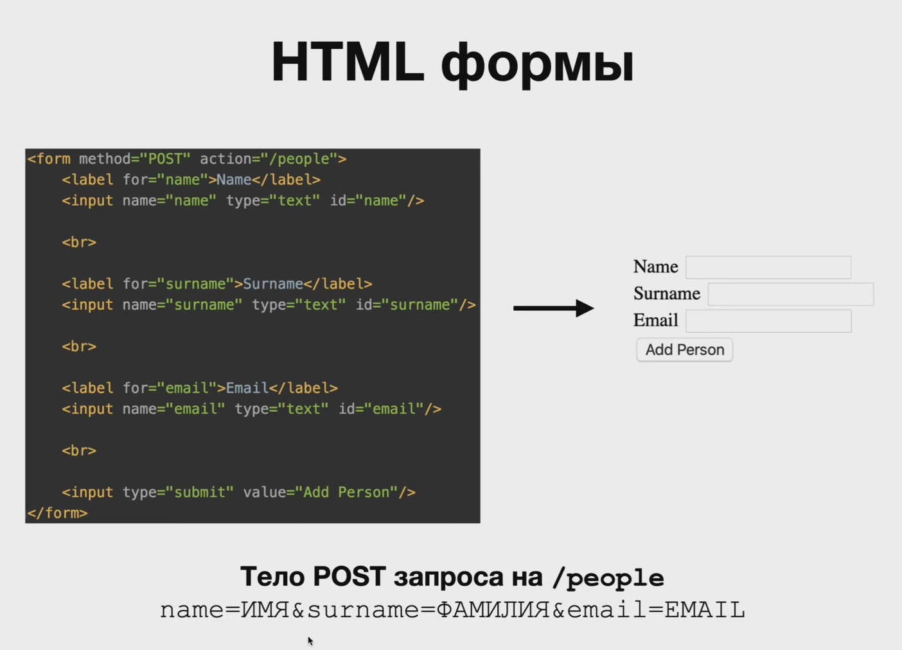

# CRUD Application
## lesson 21 - CRUD, REST, Паттерн DAO (Data Access Object)

### План работы:


- Разработана иерархия каталогов, объединяющих отдельные модули:
  - config - конфигурация Spring Application
  - controllers - расположение контроллеров, принимающих запросы
  - DAO(Data Access Object) - классы, определяющие доступ к данным, использующие модели `models` из соответствующего каталога
  - models - классы, определяющее то, как выглядят объекты данных, в дальнейшем сущностей БД

- Через конструктор внедрена зависимость `PersonDAO`:
```java
    private final PersonDAO personDAO;

    @Autowired
    public PeopleController(PersonDAO personDAO) {
        this.personDAO = personDAO;
    }
```
- Которая в свою очередь является сущностью класса PersonDAO и обладает методами, при вызове которого происходит возврат данных для загрузки в `Model` для передачи во `View`
```java
    @GetMapping()
    public String index(Model model){
        model.addAttribute("people", personDAO.index());
        // Получим всех людей из DAO и передадим на отображение в представление
        return "people/index";
    }
```
- Сам Data Access Object хранит в себе пока список с данными по пользователях, содержащий в себе объекты класса `Person`. В классе также есть методы, возвращающие объекты или строчное представление данных:
```java
@Component
public class PersonDAO {
    private static int PEOPLE_COUNT;
    private List<Person> people;

    {
        people = new ArrayList<>();

        people.add(new Person((++PEOPLE_COUNT), "Tom"));
        people.add(new Person((++PEOPLE_COUNT), "Bob"));
        people.add(new Person((++PEOPLE_COUNT), "Mike"));
        people.add(new Person((++PEOPLE_COUNT), "Katy"));
    }

    public List<Person> index() {
        return people;
    }

    public Person show(int id){
        return  people.stream().filter(person -> person.getId() == id).findAny().orElse(null);
    }
}
```

- Для вывода происходит обращение к шаблонизатору Thymeleaf, который использует следующую конструкцию:  
```html
<div th:each="person: ${people}">
  <a th:href="@{/people/{id}(id=${person.getId()})}"  th:text="${person.getName()}"> User</a>
</div>
```

## lesson 22 - @ModelAttribute, POST
### Реализация POST

- Создание обработчиков в контроллере `PeopleController`
```java
@GetMapping("/new")
public String newPerson(Model model){
        model.addAttribute("person", new Person());
        return "people/new";
        }

@PostMapping
public String create(@ModelAttribute("person") Person person){
        personDAO.save(person);

        return "redirect:/people";
        }
```
- Аннотация `@ModelAttribute("person") Person person` способна сама выбрать из запроса необходимые поля и по ключам создать объект класса


- В DAO реализован метод `save()`, который принимает объект Person и добавляет в список
```java
public void save(Person person) {
        person.setId(++PEOPLE_COUNT);
        people.add(person);
    }
```

- Создание HTML документа с формой для последующей передачи данных в POST запрос
- Указать подключение Thymeleaf:
```html
<html lang="en" xmlns:th="http://thymeleaf.org">
```
- Создание формы:
```html
<form th:method="POST" th:action="@{/people}" th:object="${person}"> <!--// $ для обращения к адресам и переадресации-->
  <label for="name">Name: </label>
 <input type="text" th:field="*{name}" id="name"> <!-- // * для обращения к полю приходящего объекта-->

  <br>

  <input type="submit" value="Create!"/>

</form>
```

## lesson 23 - UPDATE, DELETE
- В классе контроллера добавляем функции на управление и исполнение редактирования данных
```java
    @GetMapping("/{id}/edit")
    public String edit(Model model, @PathVariable("id") int id) {
        model.addAttribute("person", personDAO.show(id));
        return "people/edit";
    }


//    @PatchMapping("/{id}")
    @PostMapping ("/{id}")
    public String update(@ModelAttribute("person") Person person,
                         @PathVariable("id") int id){
        personDAO.update(id, person);
        return "redirect:/people";
    }
```
(Возникают проблемы с PATCH запросами, т.к. HTML 5 поддерживает только GET и POST запросы)

- В DataAccessObject добавляем функцию на обновление данных в списке
```java
    public void update(int id, Person updatedPerson) {
        Person personToBeUpdated = show(id);

        personToBeUpdated.setName(updatedPerson.getName());
    }
```

- В свою очередь HTML файл выглядит следующим образом:
```html
<H1>To change information</H1>
<form th:method="POST" th:action="@{/people/{id}(id=${person.getId()})}" th:object="${person}">
    <label for="name">Enter name: </label>
    <input type="text" th:field="*{name}" id="name"/>
    <br/>
    <input type="submit" value="Update!"/>
</form>
```

Стоит отметить, что для подстановки в адресную строку `{id}` необходимо использовать action `th:action="@{/people/{id}(id=${person.getId()})}`

Аналогично для удаления(ОДНАКО DELETE сработал корректно)